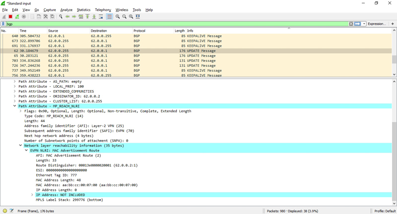
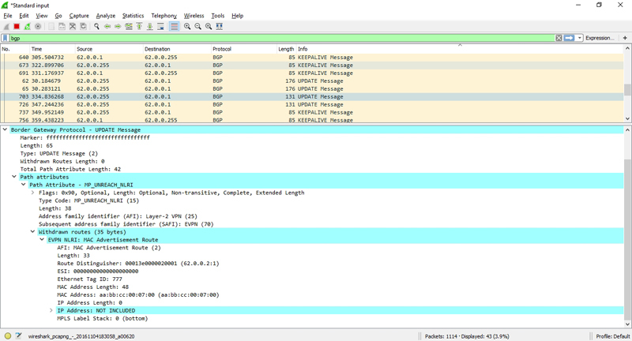

# Изучение MAC-адресов

Теперь посмотрим на MAC-таблицу на PE1:

```text
bormoglotx@RZN-PE-1> show bridge mac-table

MAC flags       (S -static MAC, D -dynamic MAC, L -locally learned, C -Control MAC
    SE -Statistics enabled, NM -Non configured MAC, R -Remote PE MAC)

Routing instance : RZN-VPN-1
 Bridging domain : VLAN-777, VLAN : 777
   MAC                 MAC      Logical          NH      RTR
   address             flags    interface        Index   ID
   aa:bb:cc:00:06:00   D        ge-0/0/2.0
   aa:bb:cc:00:07:00   DC                        1048575 1048575
```

Колонка flag говорит нам о том, как был изучен данный адрес: MAC-адрес aa:bb:cc:00:06:00 имеет только флаг D, что означает, что этот мак изучен динамически \(стандартным способом через data plane\) и, так как больше никаких флагов мы не видим, то можем с уверенностью сказать, что данный MAC изучен от локально подключенного CE маршрутизатора. А вот MAC-адрес aa:bb:cc:00:07:00 имеет два флага — DC. Что значит первый флаг, мы уже знаем, а вот флаг С говорит о том, что данный адрес изучен через control plane.

Если мы посмотрим на таблицу MAC-адресов на PE3, то увидим, что все адреса изучены данным PE маршрутизатором через control plane, и нет ни одного локального MAC-адреса:

```text
bormoglotx@RZN-PE-3> show evpn mac-table

MAC flags       (S -static MAC, D -dynamic MAC, L -locally learned, C -Control MAC
    SE -Statistics enabled, NM -Non configured MAC, R -Remote PE MAC)

Routing instance : RZN-VPN-1
 Bridging domain : __RZN-VPN-1__, VLAN : 777
   MAC                 MAC      Logical          NH      RTR
   address             flags    interface        Index   ID
   aa:bb:cc:00:06:00   DC                        1048574 1048574
   aa:bb:cc:00:07:00   DC                        1048575 1048575
```

> Примечание: если вы заметили, в одном случае я использовал команду show bridge mac-table, а во втором show evpn mac-table. Это обусловлено тем, что на разных PE маршрутизаторах routing instance сконфигурированы по-разному — в первом случае virtual-swicth, во втором EVPN.

На PE3 нет ни одного изученного локально MAC-адреса, так как еще не было трафика от CE3. Давайте исправим данную ситуацию, запустив пинг до CE3, и еще раз посмотрим данную таблицу:

```text
RZN-CE1-SW1#ping 10.0.0.3
Type escape sequence to abort.
Sending 5, 100-byte ICMP Echos to 10.0.0.3, timeout is 2 seconds:
.!!!!
Success rate is 80 percent (4/5), round-trip min/avg/max = 7/10/13 ms
```

```text
bormoglotx@RZN-PE-3> show evpn mac-table

MAC flags       (S -static MAC, D -dynamic MAC, L -locally learned, C -Control MAC
    SE -Statistics enabled, NM -Non configured MAC, R -Remote PE MAC)

Routing instance : RZN-VPN-1
 Bridging domain : __RZN-VPN-1__, VLAN : 777
   MAC                 MAC      Logical          NH      RTR
   address             flags    interface        Index   ID
   aa:bb:cc:00:05:00   D        ge-0/0/2.777
   aa:bb:cc:00:06:00   DC                        1048574 1048574
   aa:bb:cc:00:07:00   DC                        1048575 1048575
```

Как видите, на PE3 теперь появился MAC-адрес CE3, изученный через data plane.

Как и у обычного свича, адреса в MAC-таблице EVPN имеют определенный “срок годности”, по умолчанию этот срок равен 300-м секундам. Если в течении данного времени этот MAC был неактивен и не обновлялся, то маршрут удаляется из таблицы. Вроде, все просто — таймер отработал — MAC удалили. Но все не так просто, как кажется. Давайте рассмотрим, как это происходит.

Итак, PE3 изучил MAC-адрес CE3 и отправил его в BGP анонсе остальным PE маршрутизаторам. Предположим, что в течении 300 секунд запись не обновлялась. Тогда PE3 должен удалить данный MAC-адрес из таблицы, что он и делает. Но мы помним, что PE3 отправил всем своим соседям информацию о том, что данный MAC-адрес находится за ним. А вдруг этот хост переехал или вообще уже выключен? Что тогда? Остальные PE маршрутизаторы так и будут слать пакеты для CE3 на PE3, как в черную дыру? Конечно, нет. Дело в том, что если PE маршрутизатор удаляет из таблицы локальный MAC-адрес, то он отправляет BGP Withdrawn сообщение, которое заставляет другие PE маршрутизаторы удалить этот маршрут, а следовательно и MAC-адрес, из своих таблиц. Давайте это проверим.

На первом скрине представлен BGP UPDATE Message, который объявляет MAC-адрес aa:bb:cc:00:07:00 \(картинки кликабельны\):  

Спустя 300 секунд, мы видим еще одно BGP UPDATE Message, которое является Withdrawn сообщением, отменяющим маршрут до указанного ранее MAC-адреса:  

Помимо MAC aging time, у EVPN есть механизм сигнализации о смене MAC-адреса. Когда от CE маршрутизатора PE-ка получает Gratuitous ARP, то генерируется BGP Update, в котором содержится withdrawn сообщение с указанием старого MAC-адреса и анонс нового MAC-адреса.

Но помимо MAC-адреса маршрут MAC/IP Advertisement route может опционально содержать в себе и IP-адрес хоста. Добавим в наш EVPN роутинговый-интерфейс IRB и посмотрим какой маршрут появился:

```text
bormoglotx@RZN-PE-1> show configuration interfaces irb.777
family inet {
    address 10.0.0.254/24;
}
mac 02:00:00:00:00:02;

bormoglotx@RZN-PE-1> show route table RZN-VPN-1.evpn.0 match-prefix *2:62.0.0.1:1::777::02*

RZN-VPN-1.evpn.0: 18 destinations, 18 routes (18 active, 0 holddown, 0 hidden)
+ = Active Route, - = Last Active, * = Both

2:62.0.0.1:1::777::02:00:00:00:00:02/304
                   *[EVPN/170] 14:17:31
                      Indirect
2:62.0.0.1:1::777::02:00:00:00:00:02::10.0.0.254/304
                   *[EVPN/170] 14:17:31
                      Indirect
```

Появились два новых маршрута, причем первый это только MAC-адрес irb.777, а вот второй MAC+IP. Mac+IP анонс имеет вид ARP записи, все PE маршрутизаторы, участвующие в одном EVPN-домене, синхронизируют свои ARP записи, что позволяет уменьшить количество флуда широковещательных ARP запросов по сети провайдера.

Теперь посмотрим на маршрут внимательнее:

```text
bormoglotx@RZN-PE-1> show route table RZN-VPN-1.evpn.0 match-prefix *2:62.0.0.1:1::777::02* detail

RZN-VPN-1.evpn.0: 18 destinations, 18 routes (18 active, 0 holddown, 0 hidden)
2:62.0.0.1:1::777::02:00:00:00:00:02/304 (1 entry, 1 announced)
        *EVPN Preference: 170
                Next hop type: Indirect
                Address: 0x940d804
                Next-hop reference count: 7
                Protocol next hop: 62.0.0.1
                Indirect next hop: 0x0 - INH Session ID: 0x0
                State: Active Int Ext
                Age: 14:21:34
                Validation State: unverified
                Task: RZN-VPN-1-evpn
                Announcement bits (1): 1-BGP_RT_Background
                AS path: I
                Communities: evpn-default-gateway
                Route Label: 300144
                ESI: 00:00:00:00:00:00:00:00:00:00
```

В данном маршруте появилось новое расширенное коммьюнити evpn-default-gateway. Именно так помечаются маршруты, которые являются основным шлюзом для routing-instance. Данный маршрут будет генерироваться для каждого влана отдельно.

Почему генерируются два маршрута? Дело в том, что первый маршрут, в котором указан только MAC-адрес, используется исключительно для свитчинга в bringe-домене, а вот маршрут MAC+IP уже используется для маршрутизации и является по своей сути ARP записью. Забегу чуточку вперед и напишу, что точно так же будут генерироваться маршруты до хостов при движении трафика в другие вланы или во внешнюю сеть \(это мы рассмотрим далее при добавлении в схему еще одного влана\).

